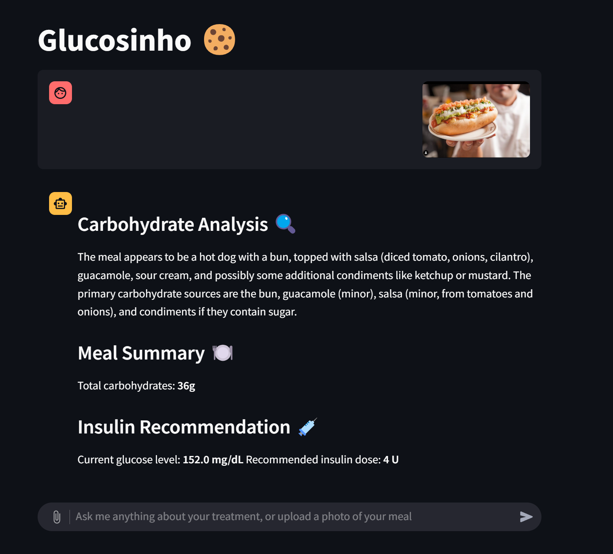

# Build Night #1

## Asistente de diabetes "Diabetinho"

Este proyecto busca el **TTEC** para personas con Diabetes Tipo 1 (time to eat completo) 🌭

Se conecta con la API de LibreLink para obtener las mediciones de glucosa en tiempo real.

Con GPT-4.1 se estima la cantidad de carbohidratos en la comida de la imagen subida.

Considerando la medición de glucosa actual y los ajustes del cliente (Ratio insulina por gramo de carbohidrato, factor de sensibilidad), se sugiere la cantidad de unidades de insulina a administrarse.

Si no se sube una imagen, se pueden hacer preguntas respecto a las mediciones recientes.

*Ejemplo:*

## Stack
- Frontend y backend python. Basado en streamlit.

## Participant Information
- Name: Pablo Dawson AbdElKader
- GitHub: https://github.com/pablodawson/
- LinkedIn: https://www.linkedin.com/in/pablo-dawson-16a8b8128/

Welcome to Build Night #1! This repository has been created for you to work on your project.
